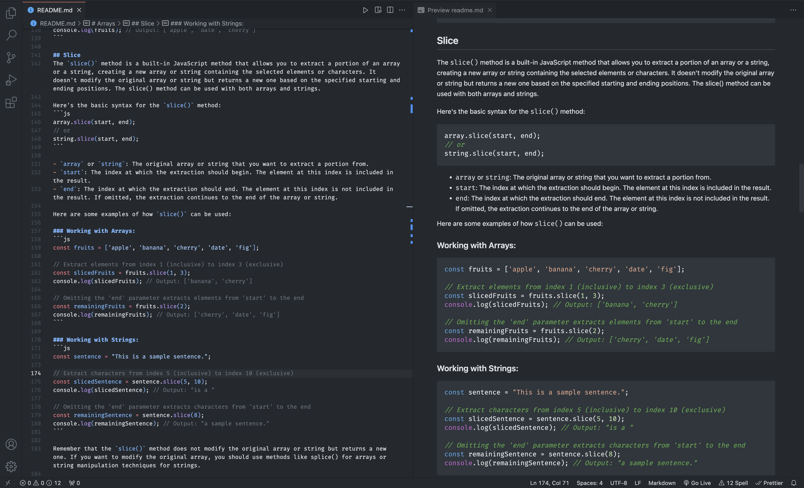
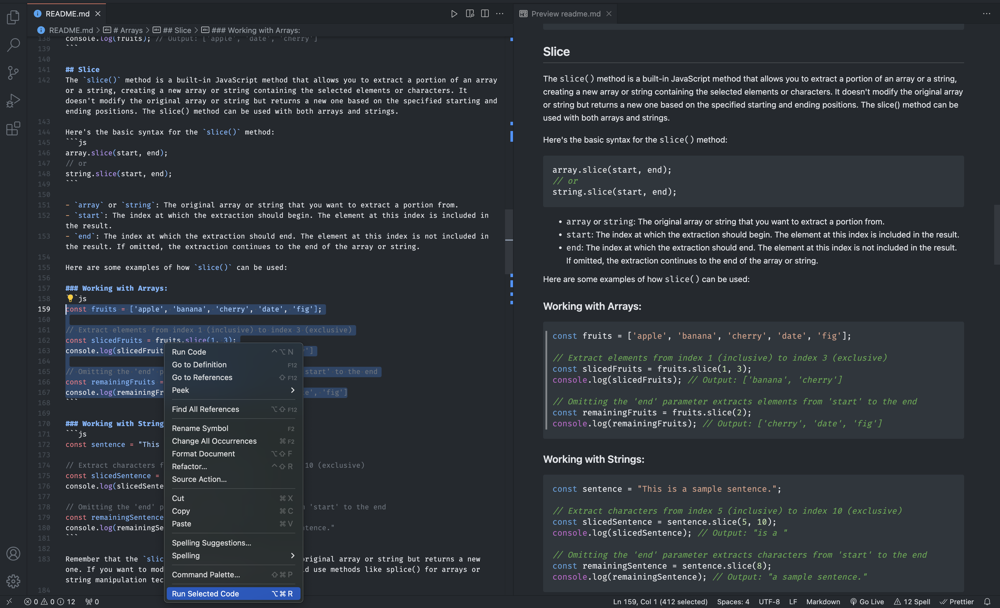
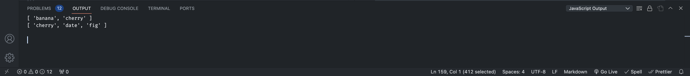

# JavaScript Code Runner

The purpose of this extension is to make it possible to run JavaScript code in any type of file. All you have to do is select the piece of code, right-click and select the `Run Selected Code` option. The code will be executed and the result will be output.

The idea for this extension came about while I was creating some documentation and files for study using markdown. I felt the need to validate that some of the code examples I was using, simple JavaScript scripts, were working correctly. That's when I decided to create this extension. The inspiration came from the way it executes queries in the database. 

## Features

This extension was designed to perform just one operation, the execution of selected JavaScript code in any type of file.

### Execute the selected JavaScript code

#### Select the code

In any file type, select the JavaScript code.

#### Run the code

Right-click and select the "Run Selected Code" option or press the following keys:

- Windows: ctrl+alt+r
- Mac: cmd+alt+r

#### Check the output

The code goes to JavaScript Output.

## Contribute

Contributions are always welcome!
Please read the [CONTRIBUTING.md](CONTRIBUTING.md) first.

## License

This project is licensed under the MIT License - see the [LICENSE.md](LICENSE.md) file for details

